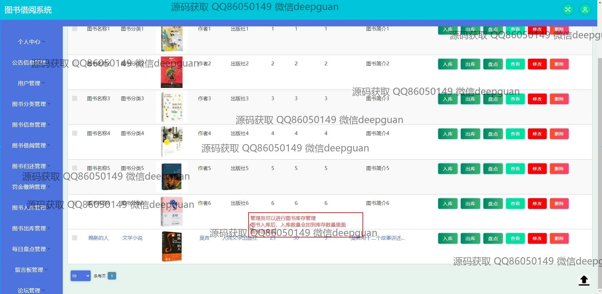
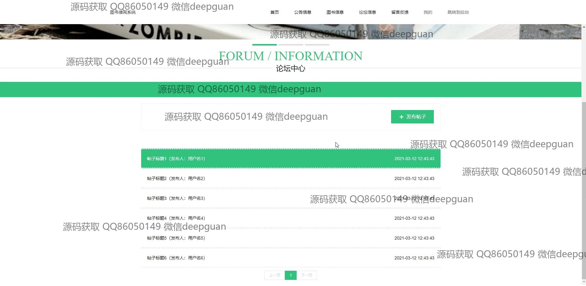
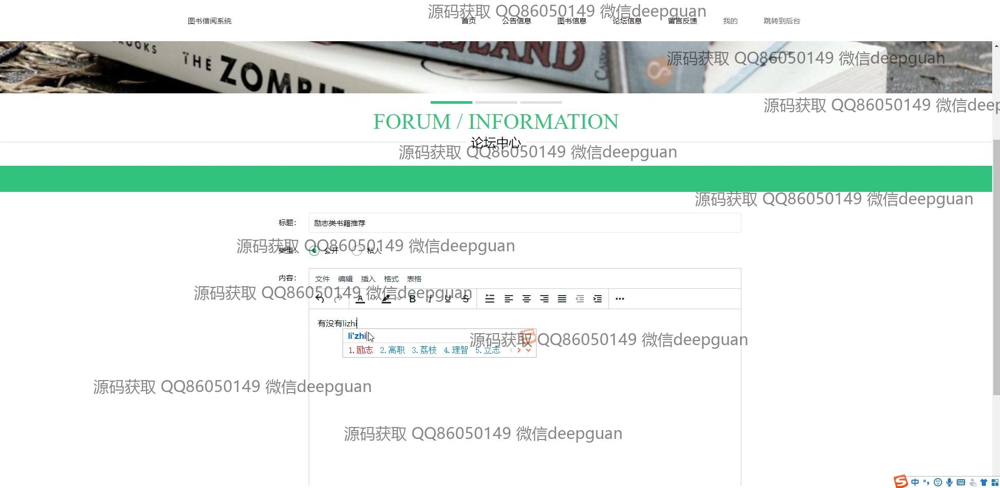
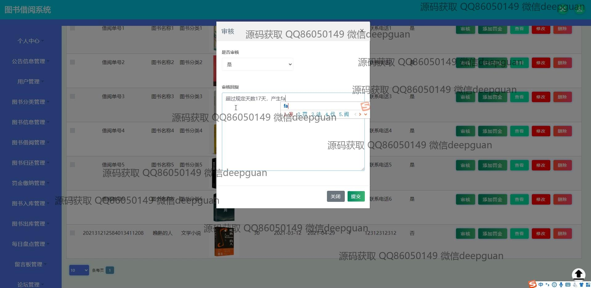
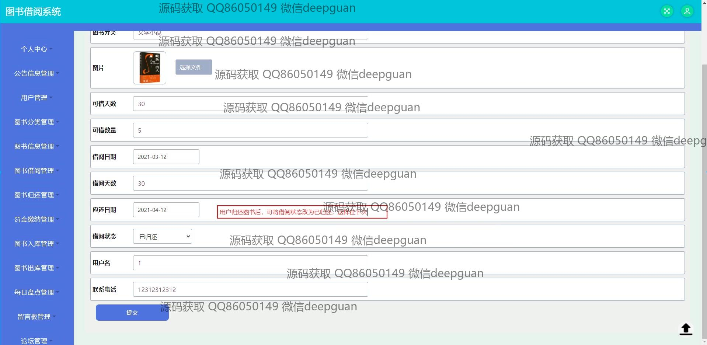
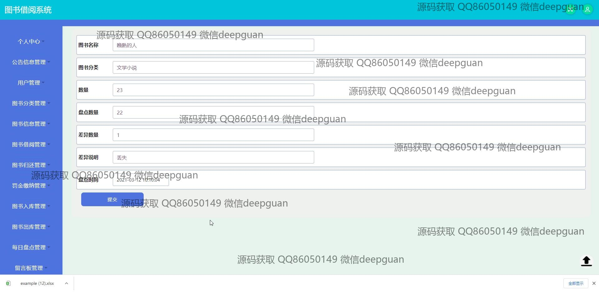

<h1 align="center">的图书借阅系统</h1>

## 简介
图书借阅系统：角色分为管理员、用户；功能包括用户管理、图书分类与信息管理、借阅归还记录管理、论坛与公告管理、罚金缴纳管理，以及注册登录与库存盘点等。    --计算机毕业设计源码；毕设源码；java毕业设计源码

## 联系方式

<h3 align="center">获取完整代码与数据库文件 + 微信：deepguan QQ: 86050149 QQ群: 783742310</h3>

<h3 align="center">可帮忙远程部署 包运行成功！提供远程部署、修改代码、设计文档指导、代码讲解等服务！</h3>

## 功能介绍（完整见运行截图）
管理员：基本功能包括登录、注册和退出。界面管理包括公告信息管理、用户管理、图书分类与信息管理、轮播图管理等。借阅管理中需审核借阅申请、处理罚金、更新借阅和归还状态，以及盘点图书库存。还可进行图书信息入库、出库、编辑和删除，留意库存更新。论坛管理需审核和维护帖子，支持批量删除和筛选操作。

用户：用户可通过注册和登录访问系统，查看和修改个人信息。浏览导航栏提供的首页、公告、图书信息和论坛接口。图书模块可查询和浏览书籍详情，包括书名、作者、分类和库存。用户能进行借阅操作，管理个人借阅记录，并查看借阅状态。论坛模块允许用户发帖、回复和参与交流。另外，系统支持用户收藏心仪书籍。

## 运行截图

本代码来源于网络,仅供学习参考使用!

